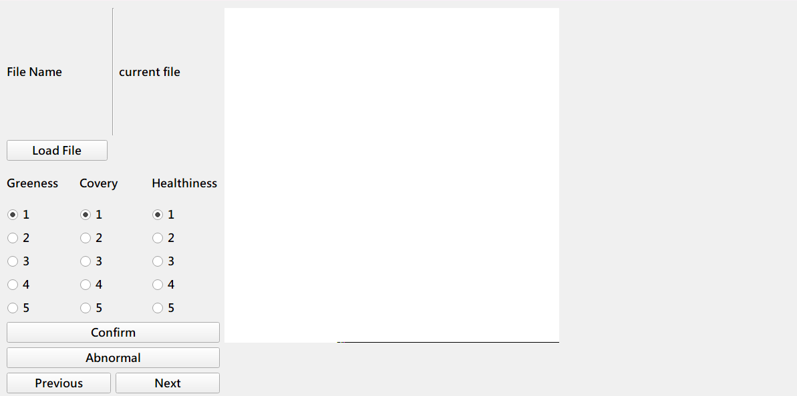
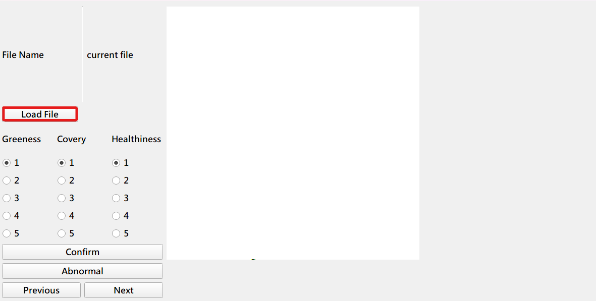
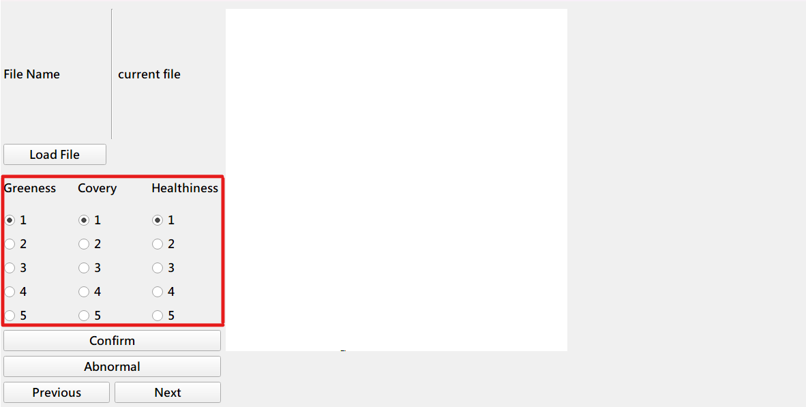
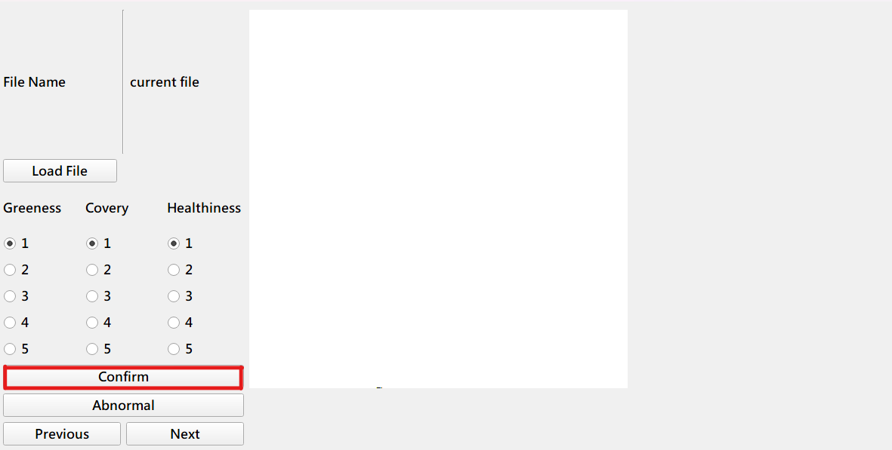
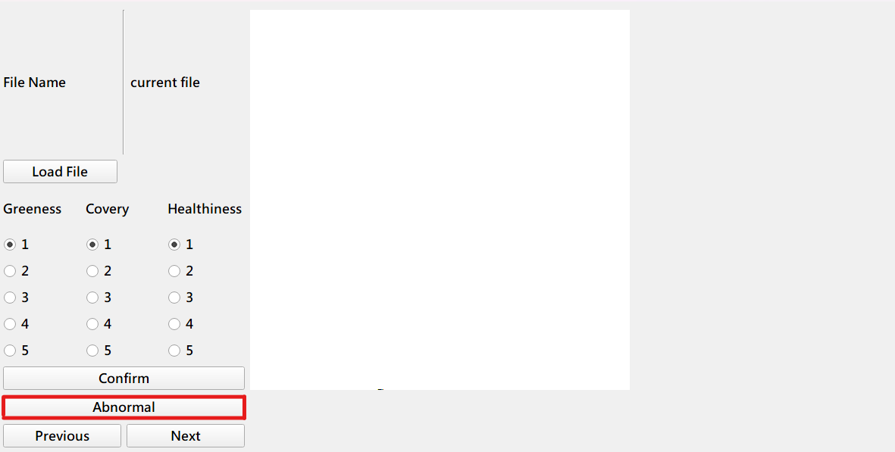
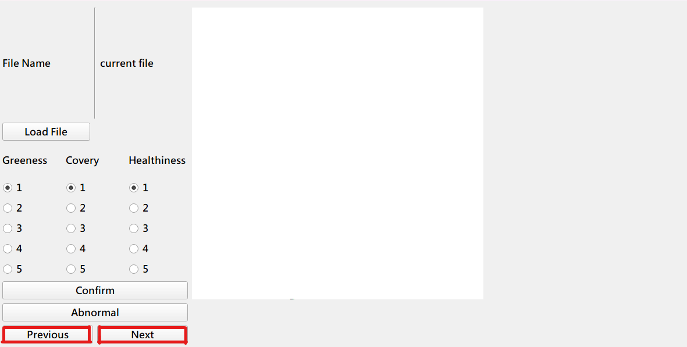

# 草坪圖片標示操作說明

可透過此應用程式開啟資料夾內圖片，並對個別圖片評比健康度、覆蓋度與綠度，以下將對如何操作進行說明。

## 開啟應用程式

### Step 0. 檢查是否安裝python

此應用程式是利用 python 完成，需在本機安裝 python 得以運行，開啟終端機輸入以下訊息

Windows:

```powershell
python -V
```

MacOS, Linux

```shell
python3 -V
```

若已安裝會顯示目前安裝版本如下

```
Python 3.10.9
```

若未安裝或安裝版本為 `python2.x.x` 請按[這裡](https://www.python.org/downloads/ "連結到python官網")安裝最新版

---

### Step 0-1. (建議)開啟虛擬環境

可透過建立虛擬環境開啟僅供此應用程式的環境，不影響到其他會應用套件產生版本問題

#### Step 0-1-1. 確認pip為最新版本

Windows:

```powershell
python -m pip install --upgrade pip
```

MacOS/Linux:

```shell
python3 -m pip install --upgrade pip
```

#### Step 0-1-2. 安裝虛擬環境套件

Windows:

```powershell
python -m pip install --user virtualenv
```

MacOS/Linux:

```powershell
python3 -m pip install --user virtualenv
```

#### Step 0-1-3. 建立虛擬環境

Windows:

```powershell
python -m venv venv
```

MacOS/Linux:

```shell
python3 -m venv venv
```

#### Step0-1-4啟動虛擬環境

Windows:

```powershell
.\venv\Scripts\activate
```

MacOS/Linux:

```shell
source venv/bin/activate
```

---

### Step 1. 安裝套件

本次應用 `PyQt5`作為圖形化介面，`numpy`與 `pandas`處理數據，`pillow`處理影像，需安裝相對應套件。所有所需套件已列在 `requirements.txt`中，可直接透過下面介紹的方式安裝

Windows:

```powershell
python -m pip install -r requirements.txt
```

MacOS/Linux:

```shell
python3 -m pip install -r requirements.txt
```

即完成安裝套件

---

### Step 2. 開啟應用程式

Windows:

```powershell
python ./main_PyQt5.py
```

MacOS/Linux:

```shell
python3 ./main_PyQt5.py
```

## 開始標記

開啟應用程式後會跳出一個視窗，即可開始標記



### 導入照片

點選 `Load File `按鈕後會彈出選擇檔案資料節的視窗，選擇照片所在的資料夾後按下確認即會導入照片，並在 currrent file 處顯示目前檔名。



### 評估健康度、綠度與覆蓋度

在左側三個欄位由左至右分別綠度(Greeness)、覆蓋度(Covery)與健康度(Healthiness)可選擇，選擇各項指標評比



完成後按下 `Confirm`鍵即可存檔。



若出現無法處理的照片，請按下Abnormal，在輸出檔案會顯示NA表示無法處理



### 上下一張照片

完成此照片後可跳至下一張照片接續處理，或至上一張照片修正，按下Previous可前往上一張，按下Next可前往下一張

**注意：請按下確認鍵確認存檔後再前往下一張照片，以防資訊遺失**



## 輸出檔案

完成標記後將匯出 `output.csv `與 `output.json` 兩個檔案，即為標記的內容以供後續處理
